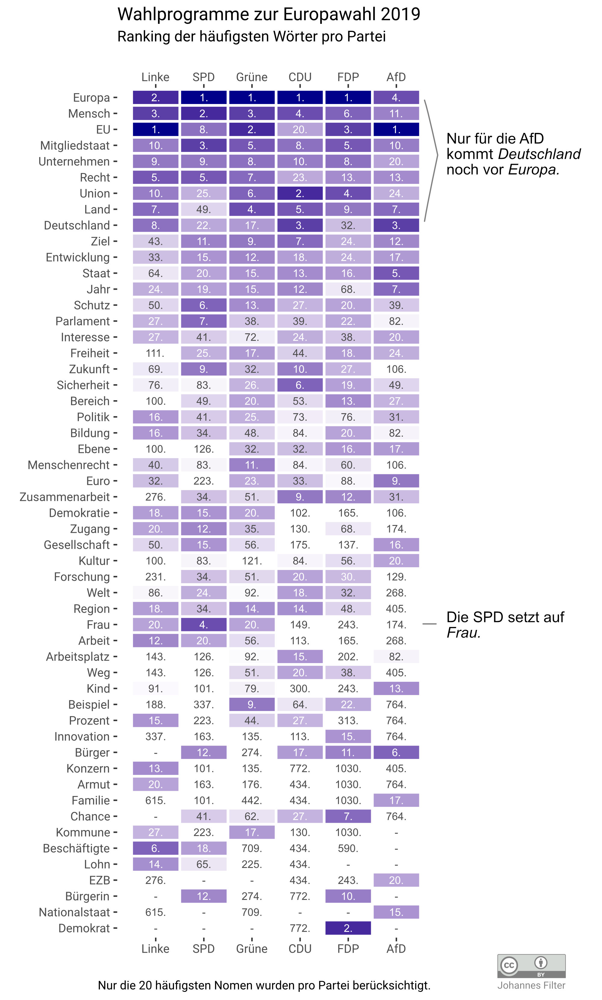

# Visualization of the most frequent words in the German 2019 EU election programs.

  

## Analysis (in German)

Bei der AfD kommt als einzige Partei "Deutschland" noch vor "Europa". In ihrem Wahlprogramm gibt es wenig "Zukunft" dafür aber mehr Vergangenheit. Das zeigen Wörter wie: "Kind, "Familie" und "Nationalstaat". Sie bedienen mit "Euro" und "EZB" aber auch klassische eurokritische Haltungen.

Mit "Frau" auf Platz 4 sticht die SPD besonders hervor. Gerade gegenüber den drei rechten Parteien. Auffällig ist, dass die SPD bei "Sicherheit" und "Euro" an letzter Stelle steht.

Die Linke hat mit "Lohn", "Beschäftigte", "Konzern" und "Armut" ein eigenes Vokabular. Jedoch fehlt es ihnen an "Zusammenarbeit" und "Freiheit". "Bürgerin" kommt bei ihnen nicht vor, weil sie das Wahlprogramm konsequent gendern.

Bei den Grünen werden oft "Beispiele" angebracht werden und "Menschenrechte" thematisiert. Von "Interessen" wird seltener gesprochen.

Die CDU haben mit "Sicherheit" und "Arbeitsplatz" zwei Alleinstellungsmerkmale. "EU" oder "Recht" werden jedoch unterdurchschnittlich oft benutzt.

Bei der FDP kommt "Demokrat" auf Platz 2. Jedoch nur, weil sie sich selbst als "freiheitliche Demokraten" bezeichnen. "Chance" und "Innovation" sind ihre Steckenpferde. Über "Lohn" hingegen, reden sie ungern – es kommt kein einziges Mal vor.

## Acknowledgements

Based on the cleaned data by Sebastian Schröder and Marco Holz: <https://github.com/basti-schr/eu-wahlprogramme>

Thanks to Simon Jockers et al. for organizing the [Wahlsalon 2019](https://www.meetup.com/OK-Lab-Berlin/events/259818253/).

## License

Code: MIT

Graphic: CC BY
